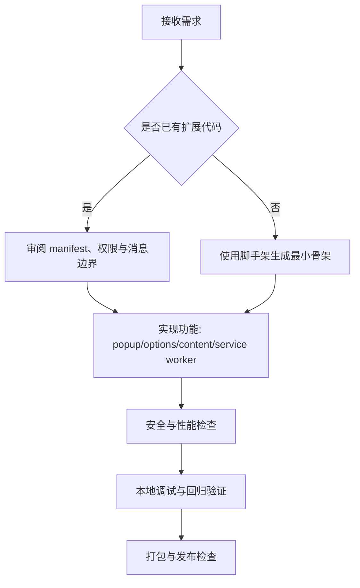

# Browser Extension Dev

## 概览

- 以 Manifest V3 作为默认实现标准，优先保证可安装、可调试、可发布。
- 优先输出最小可运行方案，再做功能迭代，避免一次性大改导致定位困难。

## 工作流

## 执行步骤

1. 澄清约束

- 明确目标浏览器（Chrome/Edge/Firefox）与最低版本。
- 明确权限边界：`permissions` 与 `host_permissions` 仅保留必要项。
- 明确数据策略：`storage.local`/`storage.sync` 的容量与同步要求。

2. 固化架构

- `background/service-worker.js` 负责事件编排与后台任务。
- `content/*.js` 仅处理页面上下文读取与安全注入。
- `popup/*` 用于轻交互；`options/*` 用于配置管理。
- 统一消息协议：固定 `type` 字段，显式校验 payload。

3. 实现功能

- 先提交可运行主链路，再补边缘功能。
- 注入脚本默认使用声明式 `content_scripts`，必要时再用动态注入。
- 任何跨上下文通信都记录来源、目标与失败重试策略。

4. 安全基线

- 禁止远程代码执行；脚本与资源仅从扩展包内加载。
- 对 DOM 注入做转义/净化，避免 XSS。
- 对 `chrome.runtime.onMessageExternal` 和 `externally_connectable` 采用白名单。
- 将敏感信息放入配置或环境注入流程，禁止硬编码密钥。

5. 性能与稳定性

- Service worker 必须幂等，避免长阻塞任务。
- 高频事件要节流/去抖；批量写入存储时做合并。
- 异步调用必须返回可观测错误，记录关键日志字段（type、tabId、url）。

6. 验证与交付

- 按 `references/mv3-checklist.md` 做实现检查。
- 按 `references/testing-release.md` 完成调试、回归与发布前检查。
- 交付内容至少包括：目录结构、关键文件 diff、验证步骤、已知限制。

## 常见请求映射

- “从零实现一个下载管理扩展”：先执行 `scripts/scaffold_mv3.sh` 生成骨架，再按功能迭代。
- “扩展在某些页面不生效”：优先检查 `host_permissions`、匹配规则与注入时机。
- “消息通信偶发失败”：排查 service worker 生命周期、消息超时与重试逻辑。

## 资源

- `scripts/scaffold_mv3.sh`：快速生成 MV3 最小可运行扩展骨架。
- `references/mv3-checklist.md`：Manifest V3 架构与安全检查清单。
- `references/testing-release.md`：本地调试、回归用例与发布检查步骤。
